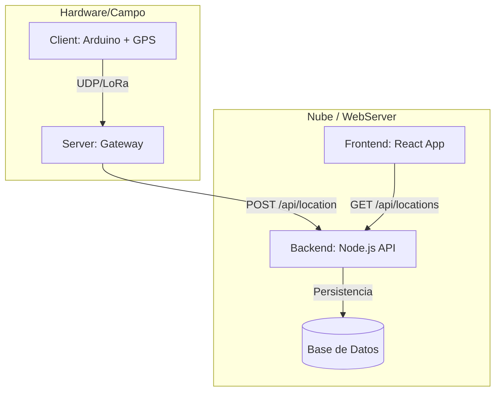

# GPS Tracking System (Modular)

Este proyecto es un sistema de rastreo GPS de extremo a extremo, diseñado de forma modular para permitir la escalabilidad y el desacoplamiento de componentes.

## Arquitectura del Sistema

El flujo de datos sigue el siguiente camino: desde el sensor físico hasta la visualización en el navegador.

## Estructura del Repositorio

*   **/client**: Código para el dispositivo embebido (Arduino/ESP32). Captura coordenadas y las transmite.
*   **/server**: Servidor de enlace (Gateway). Recibe los datos del cliente y los traduce para la API web.
*   **/WebServer/backend**: API REST encargada de recibir, guardar y servir los datos de ubicación.
*   **/WebServer/frontend**: Interfaz de usuario para visualizar los trayectos en tiempo real sobre un mapa.

## Requisitos Previos

1.  **Hardware:** Dispositivo compatible con LoRa/GPS (segundo el código en `/client`).
2.  **Entorno Web:** Node.js instalado (v18+ recomendado).
3.  **Herramientas:** PlatformIO (para el cliente) y Git.

## Instalación Rápida

1.  Configura el backend: `cd WebServer/backend && npm install`.
2.  Configura el frontend: `cd WebServer/frontend && npm install`.
3.  Configura el server: `cd server && npm install`.

## Mantenimiento

Para añadir nuevas funcionalidades, asegúrate de actualizar los contratos de la API en `WebServer/backend` antes de modificar los clientes.

---
© 2024 - Sistema de Rastreo Modular